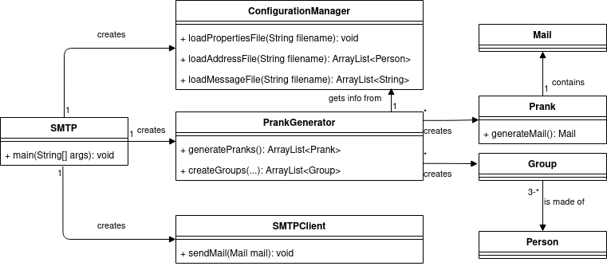

# RES - Laboratoire SMTP

> Auteurs : Gwendoline Dössegger et Cassandre Wojciechowski
>
> Date : 29.04.2021
>
> Cours : RES

## Description du projet

Au cours de ce projet, une application client TCP en Java utilisant la Socket API pour communiquer avec un serveur SMTP a été créée. Le but principal est de permettre à un utilisateur d'envoyer une campagne de mails de blagues à des "victimes". 

A partir de fichiers contenant une liste d'adresses e-mail et des modèles de mails à envoyer, l'application va générer des groupes de personnes et leur envoyer des mails standards de la part d'une des personnes membre de ce groupe. 

L'utilisateur peut installer l'application sur sa machine et s'il souhaite modifier le code source, `maven` doit être préalablement installé car le projet doit être compilé avant d'être exécuté.


## Mock Server

### Qu'est-ce qu'un `Mock Server` ?

Un `mock server` permet de tester des envois de mails sans les envoyer réellement. Le serveur `mock` va capturer les mails envoyés et les afficher sur une interface web, sans qu'ils parviennent dans les boîtes mails des destinataires. 

Ces serveurs permettent à des développeurs de tester les envois de mails automatisés sans surcharger une adresse mail existante. 

Dans le cadre de notre projet, nous avons utilisé `MockMock`, un projet de `mock server` provenant de [Github](https://github.com/tweakers/MockMock). 

### Installation avec Docker

Le projet contient le répertoire `DockerMockMock` qui lui-même contient les fichiers nécessaires au démarrage de `MockMock` dans un conteneur Docker. Pour l'utiliser, il suffit d'effectuer les commandes suivantes : 

```shell
$ ./build_image.sh
$ ./run_image.sh
```

Puis il faut se connecter sur l'interface web via un navigateur sur `172.17.0.1:8282`. Si cette adresse ne fonctionne pas, il faut faire : 

```shell
$ docker ps
// Retrouver le nom du conteneur correspondant : <nom>
$ docker inspect <nom> | grep -i ipaddr
```

Le port 8282 sera toujours utilisé. 

### Installation sans Docker

L'installation est très facile et très rapide, il faut simplement télécharger le fichier `.jar` via ce [lien](https://github.com/tweakers-dev/MockMock/blob/master/release/MockMock.jar?raw=true). Attention, il y a une modification à apporter au `pom.xml` selon les indications contenues dans cette [PR](https://github.com/tweakers/MockMock/pull/8/commits/fa4bea3079d88d7d7b9a28e3b0864ba6f3d9f7ff). 

`MockMock` va directement écouter sur le port 25 pour le protocole SMTP et l'interface web sera accessible sur le port 8282. Il peut être nécessaire de préciser les ports qu'on veut utiliser avec les options `-p` et `-h`. 

```shell
// Pour lancer MockMock avec des ports personnalisés
$ java -jar MockMock.jar -p 2525 -h 8282

// Pour lancer MockMock avec les valeurs par défaut
$ java -jar MockMock.jar
```

Après avoir lancé l'application, il faut se connecter sur l'interface web en passant par un navigateur et en allant sur `localhost:8282` ou sur le port précisé ci-dessus avec l'option `-h`. Sur l'interface web, tous les mails envoyés apparaissent. 


## Utilisation de l'application

La première action à effectuer est de cloner ce repo : 

```shell
$ git clone git@github.com:CassandreWoj/Teaching-HEIGVD-RES-2021-Labo-SMTP.git
$ cd Teaching-HEIGVD-RES-2021-Labo-SMTP
```

Afin d'utiliser l'application, il faut que l'utilisateur complète trois fichiers dans le répertoire `SMTP/config`: `config.properties`, `email_template.utf8` , `email_addresses.utf8`. Ces fichiers doivent être stockés dans le répertoire `config` à la racine du projet.

Le fichier `email_template.utf8` contient des modèles d'e-mails à envoyer ainsi que le sujet. Chaque mail est séparé par `==` avec un retour à la ligne : 

```
Subject: Bonjour toi !

Hello,
Ceci est un mail mais pas un spam.

==
Subject: 2ème sujet

Je suis une fleur, une très jolie fleur !

==
[...]
```


Le fichier `email_addresses.utf8` doit contenir des adresses e-mail de personnes à qui l'utilisateur veut jouer un tour. Une adresse e-mail est écrite sur une ligne. Nous nous sommes basés sur le format des adresses e-mail scolaires/professionnelles de beaucoup d'entreprises : 

```
prénom.nom@entreprise.ch
[...]
jean.michel@swisscom.ch
bob.dupont@rts.ch
[...]
```

Il faut mettre au minimum trois adresses dans ce fichier pour que la campagne fonctionne.


Le fichier `config.properties` doit contenir les informations nécessaires pour se connecter au serveur SMTP et pour envoyer les e-mails : 

```properties
serverAddress=172.17.0.1
port=2525
nbGroups=2
nbPeoplePerGroup=3
listVictims=config/email_addresses.utf8
emailTemplates=config/email_template.utf8
witnessesToCc=xxx.yyy@heig-vd.ch
witnessesToBcc=aaa.bbb@heig-vd.ch
```

L'utilisateur définit dans ce fichier le nombre de groupes, ainsi que le nombre de personnes par groupe qui doivent être créés. Il peut choisir des témoins à mettre en copie et/ou en copie cachée sur chaque mail envoyé.

En cas d'utilisation du Docker `MockMock`, l'adresse à utiliser est celle précisée ci-dessus. Si `MockMock` est utilisé, mais sans Docker, l'adresse du serveur à entrer est `localhost`. Si aucun `mock server` n'est utilisé, il faut entrer l'adresse du serveur SMTP à contacter (pour trouver celle-ci: `dig <domaine> MX`). 

> Attention : en cas d'utilisation de l'application avec MockMock, il faut démarrer MockMock avant de lancer l'application.

### Utilisation avec Docker

Pour lancer le projet avec un conteneur Docker, il suffit de se déplacer dans le répertoire `DockerSMTPPrank` qui contient les scripts nécessaires au démarrage de l'application et de les exécuter : 

```shell
$ ./build_image.sh
$ ./run_image.sh
```

En lançant le second script, l'application envoie une campagne de mails puis s'arrête. 

### Utilisation sans Docker

Pour utiliser l'application sans passer par Docker, l'utilisateur doit manuellement effectuer quelques commandes : 

```shell
$ mvn clean install
$ java -jar target/SMTP-1.0-SNAPSHOT.jar
```

L'application envoie une campagne de mails puis s'arrête. 


## Description de l'implémentation

### Diagramme de classes



La classe SMTP est le `main` du projet. A travers elle, nous instancions un objet `ConfigurationManager`, un objet `PrankGenerator` et un objet `SMTPClient`. 

L'objet `ConfigurationManager` permet de lire le fichier de configuration `config.properties` modifié par l'utilisateur de l'application pour y insérer ses informations personnalisées. En lisant ce fichier, il récupère toutes les informations nécessaires à l'établissement d'une connexion avec le serveur SMTP, ainsi que les informations reliées à la campagne de pranks que l'utilisateur veut mener. L'instance de `ConfigurationManager` va également lire et récupérer les adresses e-mail des victimes du prank et les modèles de mails à leur envoyer. 

L'objet `PrankGenerator` va s'occuper de générer les pranks en créant les groupes de victimes (les groupes sont composées de personnes, qui sont représentées par une adresse e-mail, un prénom et un nom), puis en appelant la classe `Prank` qui va elle, générer le mail à envoyer au groupe. 

L'objet `SMTPClient` va s'occuper de la communication réelle avec le serveur : il envoie les données selon le protocole SMTP et lit les réponses. 

### Exemples

Exécution de l'application avec Docker (dialogue entre le client et le serveur SMTP) : 


Réception des e-mails sur l'interface web de MockMock :


Vue complète de l'e-mail reçu sur l'interface web de MockMock : 


Notification dans le terminal de MockMock que les e-mails ont bien été reçus :

